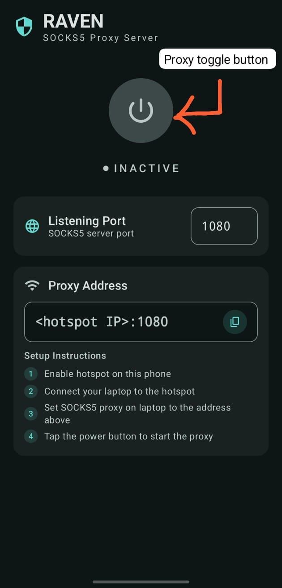
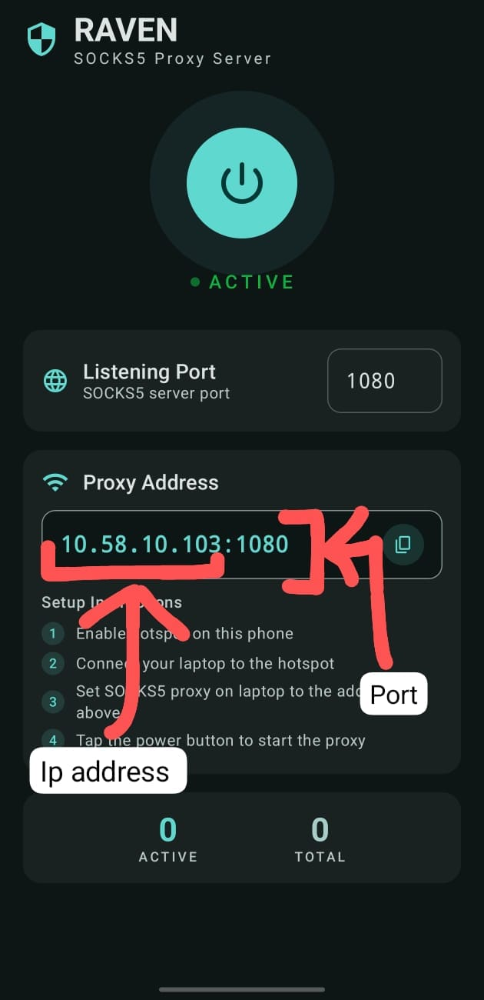
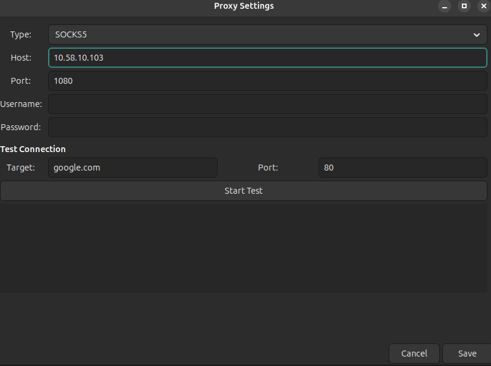

<h1 >
  
  Raven
</h1>

*Raven* is an android proxy that can hide the presence of devices connected to android via hotspot from the external world. It can be used for hotspot data sharing and the external entities would perceive it as coming directly from the android device.


### Behind the scenes
1. On the android device, raven listens for **SOCKS5** commands coming from the android device's hotspot clients (e.g laptop).
2. Raven receives **IP packets with encrypted payload from laptop** (TCP tunnel 1) and creates **new IP packets with exact same encrypted payload** and forwards them (TCP tunnel 2) to the requested web address.
3. Any request from a remote server to the laptop routes via raven. Raven **maintains a tunnel 1 <-> tunnel 2 mapping for each connection** it creates and hence can route a remote request to the correct local client, like the laptop in this case.

# Structure
```
raven
├── app
│   ├── build.gradle.kts
│   └── src
│       └── main
│           ├── AndroidManifest.xml
│           └── java
│               └── com
│                   └── kart1kg
│                       └── raven
│                           ├── data
│                           │   └── ServerState.kt
│                           ├── engine
│                           │   ├── ConnectionInfo.kt
│                           │   ├── Socks5Connection.kt
│                           │   ├── Socks5Constants.kt
│                           │   └── Socks5Server.kt
│                           ├── MainActivity.kt
│                           ├── service
│                           │   └── SocksProxyService.kt
│                           ├── ui
│                           │   ├── ProxyScreen.kt
│                           │   ├── ProxyViewModel.kt
│                           │   └── theme
│                           │       ├── Color.kt
│                           │       ├── Theme.kt
│                           │       └── Type.kt
│                           └── util
│                               └── NetworkUtils.kt
├── build.gradle.kts
├── gradle.properties
├── gradlew
├── gradlew.bat
├── hotspot-client
│   ├── proxy-off.sh
│   └── proxy-on.sh
├── local.properties
├── Readme.md
└── settings.gradle.kts
```

# Get Set Go!!
### Setting up the android proxy server
1. Turn on your device hotspot.
2. Install the *raven* app on your android device and launch it.
3. Click on the power button to toggle proxy server on/off. Turn it on.
4. The server runs on the device port 1080, which is default for SOCKS5 protocol.

    
    
  

### Setting up hotspot client to use proxy
The hotspot client, laptop in this example won't know on it own that it needs to talk to the proxy server to make network requests. So we need to tweak some network settings to let it know about that.

Note: Turn on **use secure dns** option in your browser's privacy settings.

#### A. GUI for any device
1. Install a proxy manager, like *ProxyBridge* on your hostspot client. https://interceptsuite.com/download/#proxybridge (Download ProxyBridge and not InterceptSuite, both are on the same page)
2. Connect the client to your android device's hotspot network.
3. Launch *ProxyBridge* and click on add a proxy in its settings.
4. Enter the same ip address and port that's being displayed on the android app. Select SOCKS5 protocol. You may test the connection once to see that it's working. 

    

    Save it 
5. Disable the proxy when you don't want to *raven* or want to use another wifi which doesn't have *raven* installed.


#### B. Scrips for linux
The scripts are **for debian based distribution** using **tun2socks** for routing the entire OS network traffic through the android proxy *raven*. You may write similar script for any non-debian based distribution.

1. Install tun2socks and set proper permissions:
    > wget https://github.com/xjasonlyu/tun2socks/releases/download/v2.5.2/tun2socks-linux-amd64.zip  
    unzip tun2socks-linux-amd64.zip  
    sudo mv tun2socks-linux-amd64 /usr/local/bin/tun2socks  
    sudo chmod +x /usr/local/bin/tun2socks

2. Open the file *hotspot-client/proxy-on.sh* and fill your hotspot's name in the following field:
    > HOTSPOT_SSID="\<Your android hotspot name>"

    The proxy settings will only work for this hotspot network so that other wifi networks not using *raven* work normally.

3. Make the scripts *hotspot-client/proxy-on.sh* and *hotspot-client/proxy-off.sh* executable:
    > chmod +x proxy-on.sh proxy-off.sh

4. Now whenever you connect to the hotspot which uses raven as proxy, run:
    > ./proxy-on.sh

    to enable proxy settings for laptop.

5. When you want to use some other wifi network, disable proxy by:
    > ./proxy-off.sh